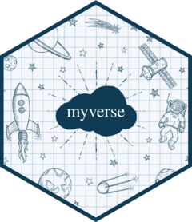

<!-- README.md is generated from README.Rmd. Please edit that file -->

```{r, include = FALSE}
knitr::opts_chunk$set(
  collapse = TRUE,
  comment = "#>",
  fig.path = "README-"
)
```

# myverse 

## Overview

Users often use their *.Rprofile* to attach the packages they often use but this
approach is not ideal as it lacks flexibility and can get in the way of reproducibility.

*{myverse}* is a fork of the *{tidyverse}* package that provides a way
to attach a predefined list of chosen packages.

You may edit your *.Rprofile* to set the `myverse.pkgs` option, and then `myverse::myverse_attach()`
will attach your chosen packages, explicitly by default, just like `library(tidyverse)`
does.

Note: Mike Kearney wrote the package [{pkgverse}](https://pkgverse.mikewk.com/) 
which has some overlapping functionalities. See comparison at the bottom.

## Installation

```{r eval = FALSE}
devtools::install_github("moodymudskipper/myverse")
```

## Usage

```{r}
# In RProfile (Recommended)
options(
  myverse.pkgs  = c("data.table", "zoo", "matrixStats")
)
# Then at the top of your main script
myverse::myverse_attach()
```

```{r}
# In RProfile (Recommended)
options(
  myverse.pkgs  = list(
    c("data.table", "zoo", "matrixStats"),
    muddyverse  = c("flow", "boomer", "typed", "doubt", "unglue", "dotdot", "inops")
  )
)

# attach only "muddyverse" packages
myverse::myverse_attach("muddyverse")
```

## Comparison with {tidyverse}

* The function `my_verse_attach()` is used to attach packages,
 `library(myverse)` doesn't attach packages since it would lack flexibility to
  attach a specific cluster of packages. An additional benefit is that if you
  call `myverse::myverse_attach()` without attaching *{myverse}* you won't
  pollute your workspace with other exported functions
* All {tidyverse} exported functions, with the exception of `tidyverse::tidyverse_logo()`,
  have a counterpart in {myverse}, namely in place of
  `tidyverse_conflicts()`, `tidyverse_deps()`,
  `tidyverse_packages()`,  `tidyverse_sitrep()` and
  `tidyverse_update()` we have
  `myverse_conflicts()`, `myverse_deps()`,
  `myverse_packages()`,  `myverse_sitrep()` and
  `myverse_update()`. They all get an additional `cluster` argument
* The option `"tidyverse.quiet"` has a `"myverse.quiet"` counterpart
* The code is essentially taken from tidyverse, alterations were done to
  adapt the functionalities and to remove dependencies towards tidyverse packages
  
## Comparison with {pkgverse}

*{pkgverse}* helps you build metapackages, it is similar in many ways but there
are a few differences to consider to make your choice :

* *{pkgverse}* generates actual packages, it makes your scripts perfectly clean 
and reproducible if you can push the metapackage to CRAN or to your organization's 
repo. Indeed it won't rely on your own system's *.Rprofile*. 
* *{myverse}* is quicker and makes it easier to iterate (e.g. overwrite a setup),
and you don't leave clutter if you don't need a setup anymore.
* *{pkgverse}* allows you to have metapackages like *{tidyverse}* be part of your package clusters while
*{pkgverse}* will insist that you provide the dependencies separately.
* *{myverse}* might support sourcing scripts in the close future.
* *{myverse}* has very lightweight dependencies (*{crayon}*, *{cli}* and *{rstudioapi}*).
